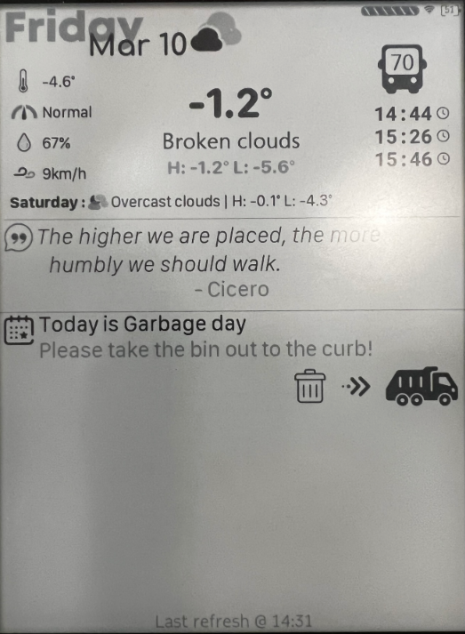

# KoboHUB: Your home HUB Dashboard on Kobo

This code is inspired and based on [YAWK ](https://www.mobileread.com/forums/showthread.php?t=316607&highlight=YAWK)

Running on Python's distribution from [NiLuJe](https://www.mobileread.com/forums/showthread.php?t=254214)

Using the excellent library [FBInk from NiLuJe](https://github.com/NiLuJe/py-fbink)

Everything was tested on a [Kobo Aura and TOUCH] (python3.9.1 on kobo-stuff-1.6.N-r18009)

# Disclaimer

This software is provided as is and may void your warranty if used.

Follow the guidelines at your own risk, I'm not responsible for any problems that might arise from this app's usage.

# Installation 

1. For best results, Reset your device to factory defaults: (This can be skipped, but it makes for a clean start)
	1. Turn it off
	1. Holding the Light Switch, slide the power button for ~1 sec
	1. Hold the Light switch until the "Restoring" screen appears
	1. Follow directions on the screen (you'll need the [Kobo Setup app](https://www.kobosetup.com) and an account, I used from RakutenKobo itself)
	1. Update everything, connect to your WiFi network
1. Provide [telnet access](https://wiki.mobileread.com/wiki/Kobo_WiFi_Hacking#Enabling_Telnet_.26_FTP) - you can skip this step if you're able to find out the IP address of the device using some other method.
	1. Check the file .kobo/ip.txt for the IP address
1. Install [NiLuJe's Stuff](https://www.mobileread.com/forums/showthread.php?t=254214) - tested with Version 1.6.N @ r18009 on 2021-Jan-22
	1. Download the pre built stuff
	1. Extract contents to a folder
	1. Connect the Kobo using the USB cable and copy the KoboRoot.tgz to the /.kobo/ folder
	1. Remove the device and let it do its thing (it should reboot)
1. Using the preferred FTP client (ie: [WinSCP](https://winscp.net/eng/download.php)), copy the repository's content to the folder /mnt/onboard/.apps/KoboHUB
1. Create an account in [Open Weather Maps](https://openweathermap.org/):
    1. Take note of your API key
    1. Find out the ID your city (use the website to check the weather in your city, copy the ID from the URL)
1. Open a SSH (or telnet) connection (user: root, password blank):
	1. Install Python 3
		```tmux new -s kobo update-kobostuff Python```
	1. Navigate to /mnt/onboard/.apps/KoboHUB/ and run install.sh
		1. if it says "-sh ./install.sh: not found", you have to convert the line endings to unix style:
		```sed -i 's/^M$//' install.sh```
		1. Answer the questions correctly

# Configuration of the KoboHUB Dashboard
> In the config.ini you can set values to below parameters

## Screen orientation support

you can set the parameter ```screen-orientation``` to ***PORTRAIT*** or ***LANDSCAPE***
you need to restart KoboHUB if you change the value for best results.

## Screen refresh rate

you can configure how oten the dashboard refreshes by setting the follwing value in the **config.ini**
```
koboHUB-refresh-seconds=60
```
by this example there is a mutipler of 5 to the value
with the value of 60 (Seconds), it will therefore refresh every 5 minutes
it is not recommended to set the value below 30

An indicator at the top right shows the mutipler counter in 5 dots.


## Weather config

Uses [Open Weather Maps](https://openweathermap.org/) as forecast and current conditions provider

- [ ] Acquire an API key, sign up for a free account here: (https://home.openweathermap.org/users/sign_up)
- [ ] once signed up - go to (https://home.openweathermap.org/api_keys) and generate one
- [ ] Now, to get your ow-city ID , go back to (https://openweathermap.org), seach for your city (for example Montreal)
- [ ] take the id from the URL or the city you selected for example in https://openweathermap.org/city/6077243 take the **6077243**
- [ ] You have now successfully configure weather :tada:

| Weather Config parameter | Description |
| --- | --- |
| ow-key | YOU NEED TO PUT YOUR API KEY HERE |
| ow-city | YOU NEED TO PUT YOUR CITY ID HERE |
| ow-units | metric or imperial |
| ow-langage | en |

for other language codes, see (https://openweathermap.org/current#multi)


## Support for static and dynamic Transit Schedule

| Transit Schedule Config parameter | Description |
| --- | --- |
| transit-feature | (TRUE to enable, FALSE to disable this feautre) **WARNING** All transit settings will be ingored if set to FASLSE |
| transit-icon | can be set to BUS, METRO or TRAM |
| transit-id | The number to display within the transit-icon Icon on the dashboard, up to ### digits |

### Support for Dynamic Transit times (using transit API)

Uses [TransitAPI] (https://transitapp.com/apis) for transit schedules - THIS FEAURE IS OFF by default
- [ ] Acquire a Transit API key, (https://forms.gle/4pNBfCRtvkGtNhDz5) - see (https://transitapp.com/apis)
- [ ] once signed up - you need to get the transit-stop (known as the global-stop-id by Transit)

#### Getting the data
I have made a small client for you to get the transit STOP id needed for the API to query on.

> it is called transit_stopfinder.py
> It uses the API Key in the **config.ini** or asks for it if not preset.

Run it and follow the on-screen instructions: 

```
[root@phoenix KoboHUB]# python transit_stopfinder.py

Using API KEY: [your API key will be here]

This will help you get the value for the [transit-stop] when using the transit API

Enter latitude (e.g. 45.526168077787894): 45.526168077787894
Enter longitune (e.g. -73.59506067289408): -73.59506067289408
Max radius (e.g. 150): 
Radius set to 150 by default, you may need to incease this value if no stops are found

Connecting to Transit API...
Getting stop ID's for location..


Found 2 stops

Global_stop_id  ->  local stop id 
_________________________________

STM:94380 local stop id -> 51752
STM:94370 local stop id -> 51742


Take the the id starting with XXX:NNNNN and map it to the one printed on your local stop

Example in Long Island NICE:46145 local stop id 3847
The NICE:46145 is the transit ID, mapped to a Local stop id 3847 - this is usually printed on the stop sign
Enter the XXXX:####into the config.ini
Example: transit-stop=NICE:46145
```
- [ ] Now, use this to find the local stop id and enter this in the **config.ini**
- [ ] Enter an id that you want to show in the dashboard in the transit-id (above)
- [ ] You have now successfully configure dynamic transit data! :tada:

### Enter Transit API results into config.ini

| Dynamic Transit Schedule Config parameter | Description |
| --- | --- |
| use-transit-api | Set this to **TRUE** to enable this, if set to **FALSE** it will be *disabled* |
| transit-apikey | YOU NEED TO PUT YOUR API KEY HERE |
| transit-stop | YOU NEED TO PUT YOUR GLOBAL STOP ID HERE |

### Support for ***static*** transit times
If you cannot or do not want o use dynamic transit times (using the Transit API)
I have added support for _static_ transit times as well.

in the **config.ini** you can configure the following :

| Static Transit Schedule Config parameter | Description |
| --- | --- |
| use-generic-transit | Set this to **TRUE** to enable this, if set to **FALSE** it will be disabled |
| generic-transit-timeframe | Can be **INTERVAL**, **FALSE**, or **ALL** - is ingored if use-generic-transit is set to FALSE |

if you set ```generic-transit-timeframe``` to **INTERVAL** - you need to consider below values
This can be used in *combination* with the **transit API** or *alone* 
if used in _combination_ you can set when the static times should take _precedence_ over the dynamic API call
This means that  you can use the static schedule ourside of peak hours (not to use the API / Wifi)

>if not, you can _igonre_ them.

| Static Transit Schedule Config parameter | Description |
| --- | --- |
| live-cutin-stop | 13 (when to start using INTERVAL) - is _ignored_ if use-generic-transit is set to **FALSE** or **ALL** |
| live-cutin-start | 5 (when to stop using INTERVAL) - is _ignored_ if use-generic-transit is set to **FALSE** or **ALL** |

**The time formant is 24h**
*in this example, the dashboard will use LIVE (Transit API) times between 5h (5 am) and 13h (1pm) - outside of that - it will use the static schedule (see below)*

> You then **MUST** configure the file ***generic_transit_schedules.ini***

| Static Transit Schedule Config parameter | Description |
| --- | --- |
| **weekdays** | |
| schedule | Enter a comma separated schedule (e.g. 05:43,06:03,05:43,06:03,06:33 etc.) |
| **saturdays** | |
| schedule | Enter a comma separated schedule (e.g. 05:43,06:03,05:43,06:03,06:33 etc.) |
| **sundays** | |
| schedule | Enter a comma separated schedule (e.g. 05:43,06:03,05:43,06:03,06:33 etc.) |

Inside the file ther are sections for weekdays, saturdays and Sundays.
If the schedule is the same for weekdays and saturdays for example, just make sure they contain is the same.
I have not split the schedule our on other days.

Once done, this will be loaded by the generic_transit sub-function and called by the main KoboHUB code.
please ensure that you follow the format or it will not work (and most likely crash)
The time format used is 24H - ***I have not coded for am/pm***

## Support for Garbage Schedules ##

To enable this feautre, you need to turn in on in the ***config.ini***

| Config.ini parameter | Description |
| --- | --- |
| garbage-show | TRUE - (Set to FALSE to DISABLE) |

*Once set to TRUE, you can then configure this in as per below*

> You ***must*** then configure the ***gargage_schedules.ini*** file with the following parameters

| Garbage Schedule Config parameter | Description |
| --- | --- |
| **landfill-schedule** | |
| title | Garbage - The description for this type of garbage |
| prepare-date-month | Enter a comma sparated daymonth e.g. 07Jan,03Feb |
| collect-date-month | Enter a comma sparated daymonth e.g. 07Jan,03Feb |
| **recycle-schedule** | |
| title | Recycle - The description for this type of garbage |
| prepare-date-month | Enter a comma sparated daymonth e.g. 07Jan,03Feb |
| collect-date-month | Enter a comma sparated daymonth e.g. 07Jan,03Feb |
| **compost-schedule** | |
| title | Compost -- The description for this type of garbage |
| prepare-date-month | Enter a comma sparated daymonth e.g. 07Jan,03Feb |
| collect-date-month | Enter a comma sparated daymonth e.g. 07Jan,03Feb |
| **dumpster-schedule** | |
| title | large garbage & dumpster - The description for this type of garbage |
| prepare-date-month  | Enter a comma sparated daymonth e.g. 07Jan,03Feb |
| collect-date-month | Enter a comma sparated daymonth e.g. 07Jan,03Feb |
| **holiday-tree-schedule** | |
| title | Holiday Tree and Branches - The description for this type of garbage |
| collect-date-month | Enter a comma sparated daymonth e.g. 07Jan,03Feb |
| **all-garbage** | |
| prepare-message | Please empty all bags into the bins! |
| collect-message | Please take the bin out to the curb! |
| collection-time-over | 18 |

>*This is the time (24h) for when the garbage collection is deemed over - signalling the collection-time-over-message-line1&2 messages*
>garbage-time-message-today=Today is 
>*Used to construct the message using the <title>* 
>For example, it will say "**Today is** _Garbage_ **day**"

| Garbage Schedule Config parameter | Description |
| --- | --- |
| garbage-time-message-tomorrow | Tomorrow is |
| garbage-time-message-end | day |
| collection-time-over-message-line1 | Collection is complete... |
| collection-time-over-message-line2 | Please take the bin back in again! |

>garbage-time-message-tomorrow=Tomorrow is 
>garbage-time-message-end=day
>*Used to construct the message using the <title>* 
>For example, it will say "**Tomorrow is** _Recycle_ & _Compost_ **day**"


**make sure you use a leading 0 for single digit days**

# Screenshot


in this example , the quote and garbage-schedule is enabled.
    

# Doubts, suggestions

noonas@gmail.com
